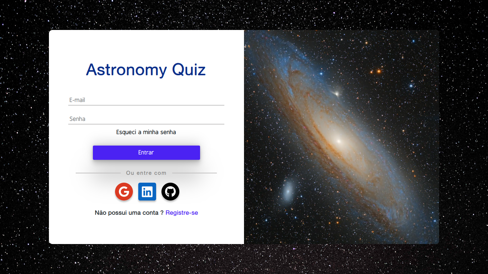

<h1 align="center">Astronomy quiz (Api)</h1>

    

<h1 align="center">
    <a href="https://github.com/MarcoLGP/astronomy-quiz-api-public">🔗 Astronomy quiz(Api)</a>
</h1>

🚀 Projeto astronomy quiz

# Tabela de conteúdos

<!--ts-->

- [Sobre](#Sobre)
- [Informações](#Informações)
- [Tecnologias](#Tecnologias)
<!--te-->

<h2 id=="Sobre">Sobre</h2>

Projeto possui o intuito didático, sem fins lucrativos.

A motivação principal do projeto é fazer uma publicação da minha manipulação das principais tecnologias do mercado, as quais utilizo em projetos em que empreendo, e que não posso deixar o repositório público.

<h2 id="Informações">Informações</h2>

O projeto foi desenvolvido em NextJs, possui reponsividade para mobile, é integrado com uma api REST desenvolvida por mim.

O usuário passará por 3 desafios, começando no nível 1, à medida que for avançando e vencendo os desafios, avançará de nível, são 5 perguntas por nível, com o tempo de 180s para responder, aumentando a dificuldade das perguntas por nível.

Para vencer os desafios será necessário acertar no mínimo 3 perguntas.

<h2 id="Tecnologias">Tecnologias</h2>

A principal tecnologia utilizada foi o NextJs/Typescript afim de uma maior produtividade e utilizar o paradigma orientado à objetos.

Demais lib's para funcionalidade do projeto, como Redux para persistência de estado e next-auth para login social.

